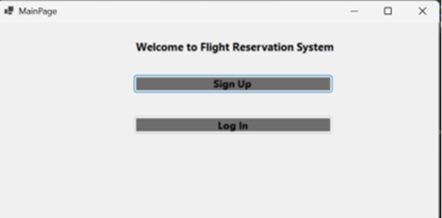
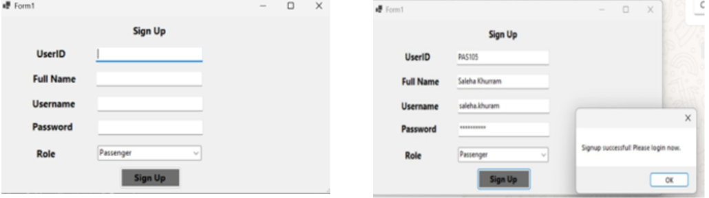
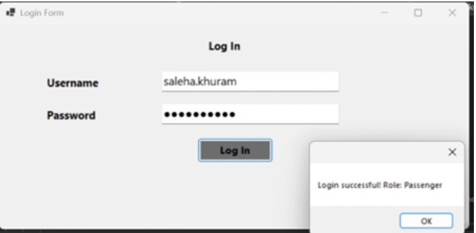
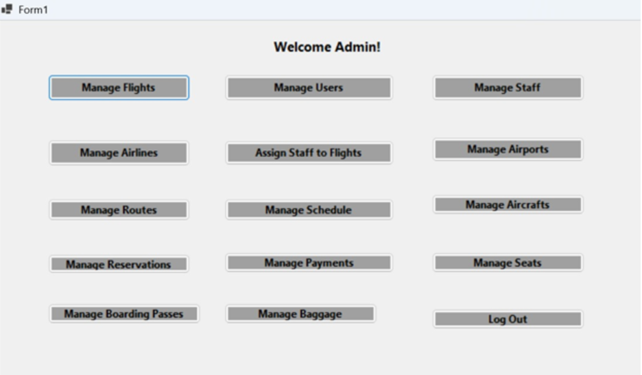
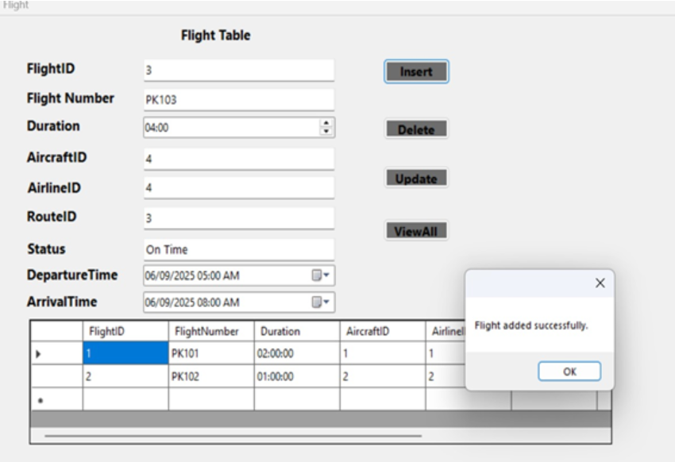
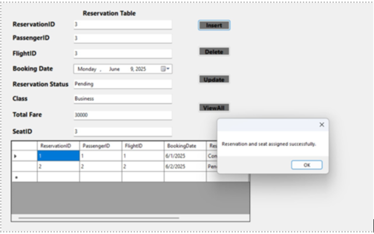
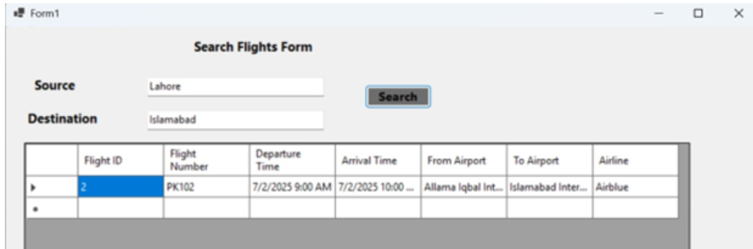
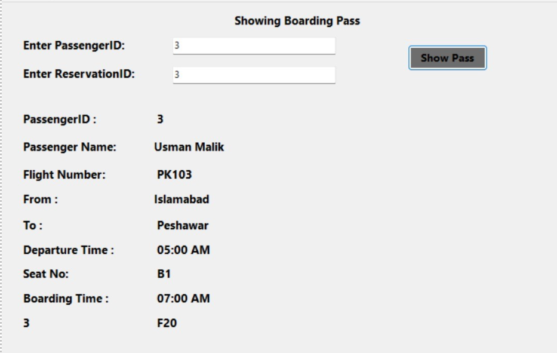
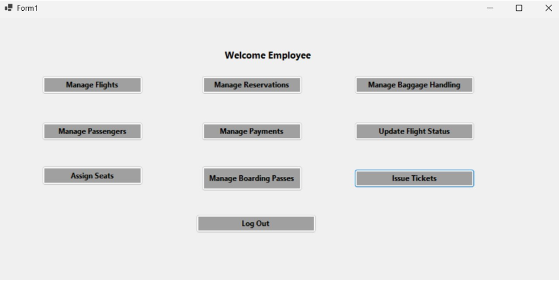
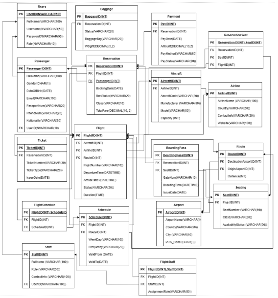

# Airline Reservation and Management System ✈️

A comprehensive Airline Reservation and Management System developed as a Database Systems semester project using C#, Windows Forms, and Microsoft SQL Server. The system simulates real-world airline operations including flight scheduling, passenger reservations, seat allocation, payment processing, baggage handling, and boarding pass generation.

---

# Overview

The Airline Reservation and Management System is designed to automate airline operations and provide an efficient platform for managing flights, passengers, reservations, payments, schedules, and staff operations.

The project demonstrates:
- Relational Database Design
- ER Modeling
- SQL Queries (DDL & DML)
- GUI Development
- Database Integration
- Role-Based Access Control

The system combines a robust SQL Server backend with a user-friendly graphical interface to simulate real-world airline workflows.

---

# Features

## Passenger Features
- User Registration & Login
- Search Flights
- Book Tickets
- Seat Selection
- Make Payments
- View Booking History
- Generate Boarding Pass
- Manage Profile
- Cancel Reservations
- Baggage Management

## Admin Features
- Manage Airlines
- Manage Flights
- Manage Airports
- Manage Routes
- Manage Schedules
- Manage Aircraft
- Manage Reservations
- Manage Payments
- Manage Seats
- Manage Boarding Passes
- Manage Baggage
- Manage Staff
- Manage Users

## Employee Features
- Update Flight Status
- Manage Reservations
- Assign Seats
- Manage Passengers
- Handle Payments
- Manage Boarding Passes
- Manage Baggage

---

# Technologies Used

## Programming Language
- C#

## Frontend / GUI
- Windows Forms (WinForms)

## Database
- Microsoft SQL Server

## Database Concepts
- ER Diagram
- Relational Schema
- Normalization
- DDL Queries
- DML Queries
- Joins
- Subqueries
- Aggregate Functions

## Development Tools
- Visual Studio
- SQL Server Management Studio (SSMS)

---

# System Workflow

## Passenger Workflow

User Registration/Login  
↓  
Search Flights  
↓  
Select Flight  
↓  
Book Ticket  
↓  
Seat Allocation  
↓  
Payment Processing  
↓  
Boarding Pass Generation  
↓  
Booking History & Reservation Management

---

## Employee Workflow

Manage Flights  
↓  
Update Flight Status  
↓  
Manage Reservations  
↓  
Assign Seats  
↓  
Handle Passenger Requests

---

## Admin Workflow

Manage Airlines  
↓  
Manage Airports & Routes  
↓  
Manage Flights & Schedules  
↓  
Manage Users & Staff  
↓  
Monitor Reservations & Payments

---

# Database Design

The database follows relational database principles to ensure:
- Data Integrity
- Data Consistency
- Efficient Query Processing
- Reduced Redundancy

## Main Tables
- Airline
- Aircraft
- Airport
- Flight
- Passenger
- Reservation
- Payment
- Ticket
- BoardingPass
- Baggage
- Seat
- Route
- Staff
- Users

## Database Functionalities
- Flight Scheduling
- Reservation Management
- Seat Allocation
- Payment Tracking
- Boarding Pass Generation
- Baggage Handling
- Staff Assignment

---

# Screenshots

## Main Page


## Sign Up Form


## Login Form


## Admin Dashboard


## Manage Flights


## Manage Reservations


## Search Flights


## Boarding Pass


## Employee Dashboard


## ER Diagram


---

# SQL Operations Included

## Data Definition Language (DDL)
- CREATE DATABASE
- CREATE TABLE
- Primary Keys
- Foreign Keys
- Constraints

## Data Manipulation Language (DML)
- INSERT Queries
- UPDATE Queries
- DELETE Queries

## Advanced SQL Queries
- JOIN Queries
- Subqueries
- Aggregate Functions

---

# GUI Overview

The system includes a graphical user interface that allows users to interact with the database using forms, buttons, tables, and dashboards instead of manually writing SQL queries.

## GUI Modules
- Login System
- Registration System
- Admin Dashboard
- Passenger Dashboard
- Employee Dashboard
- Flight Management
- Reservation Management
- Payment Management
- Seat Management
- Boarding Pass Management

---

# Challenges Solved

- Foreign Key Constraint Handling
- Data Validation
- Query Optimization
- Role-Based Access Control
- GUI & Database Integration
- Real-Time Data Synchronization
- User Authentication

---

# Future Enhancements

- Online Booking Portal
- Live Flight Tracking
- Online Payment Gateway
- SMS & Email Notifications
- Mobile Application
- Advanced Analytics Dashboard
- Stored Procedures & Triggers

---

# Installation

## Clone Repository

```bash
git clone https://github.com/salehakhuram/-airline-reservation-system.git
```

---

## Setup Instructions

1. Open project in Visual Studio
2. Configure SQL Server connection
3. Run SQL scripts
4. Build and run the application

---

# Project Documentation

📄 Full project report available in:

```txt
/docs/Airline-Reservation-System-Report.pdf
```

---

# Team Members

- Saleha Khurram
- Abeera Shahid

---

# Academic Information

**Course:** Database Systems (CS130 & CS130L)  
**Institution:** Air University Multan  
**Semester:** Spring 2025

---

# GitHub Repository

🔗 Repository Link:  
https://github.com/salehakhuram/-airline-reservation-system

---

# Author

Saleha Khurram
